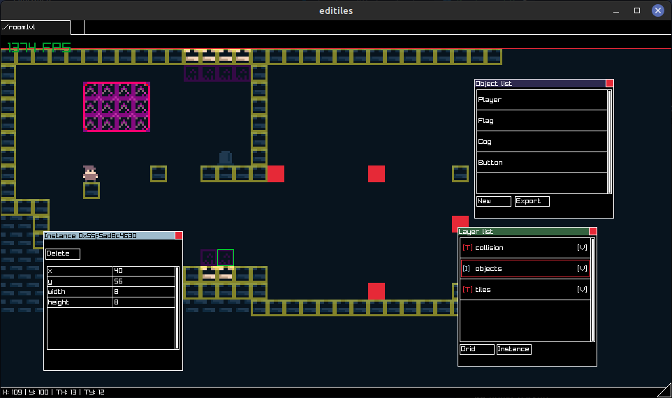

# Editiles
## A "_small_" and "_simple_" tilemap editor.



Editiles is a tilemap editor orininally made as a side project to develop a game. I started working on it at the end of August 2022, because I needed a tilemap editor and I didn't find one that matches my needs. I continued development on my free time since then. It uses a custom (_and kinda bad_) format for saving and loading.

## How do I compile and run it ?

Spoiler alert: I originally made this for myself, so you probably want to use something else as there are still a lot of issues remaining.

But if you really want to try it out, on linux you can compile it like this:
```sh
git clone --recurse-submodules https://github.com/orwenn22/editiles
cd editiles
git clone https://github.com/raysan5/raylib
cd raylib/src
make
cd ../..
make
```
On other platforms, you might need to modify the Makefile.

The only real dependency is [raylib](https://github.com/raysan5/raylib), a library that can handle stuff like drawing on a window, input, etc... If you already have it installed you probably don't need to clone it.

There is no documentation (_yet_) so your only way to know how it works and how to use it is to look at the source code (but please don't do it because it is really poorly written, your eyes might explode).

## License

This software is under the BSD 3-Clause license. You can read it [here](https://github.com/orwenn22/editiles/blob/master/LICENSE).